# FIAP X

## FIAP - Software Architecture Hackaton - Fase 5

Este projeto foi desenvolvido durante a `Fase V` do curso de `Arquitetura de Software` da FIAP como requisito para avaliação.

## Integrantes do Grupo
- Julio Augusto Silva (RM355432)
- Lucas Henrique de Oliveira Silva (RM354904)
- Getúlio Magela Silva (RM355427)
- Lucas Rego Lima (RM356101)
- Lilian Rosario de Jesus (RM355928)

## Apresentação em Vídeo

- [Assistir no YouTube](link:TODO)

## Diagramas

### Event Storming :[Ver no Miro 👁️](https://miro.com/app/board/o9J_lHsdpmE=/?moveToWidget=3458764614656328237&cot=10):

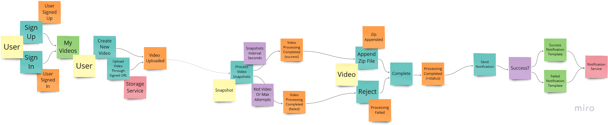

### Arquitetura Cloud :[Ver no Miro 👁️](https://miro.com/app/board/o9J_lHsdpmE=/?moveToWidget=3458764614649572419&cot=10):

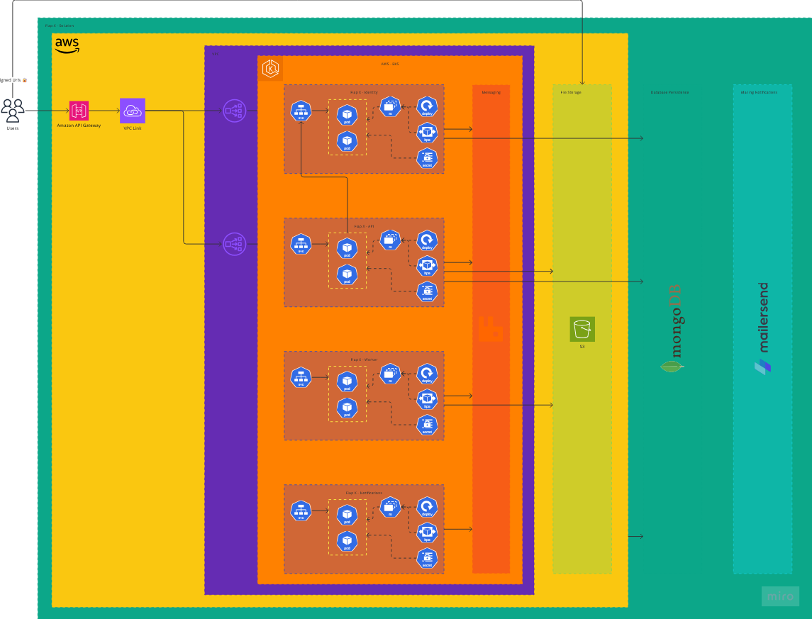

## Serviços:

### Fiap X API

Serviço responsável por gerenciar as postagens de vídeos criando URLs assinadas para upload e a gestão do conteúdo como listagem e download. O serviço realiza integração via HTTP com o serviço de identidade para validação de Tokens de acesso. A integração dos usuários da plataforma são feitas majoritariamente através deste serviço. Possui dependência com S3, RabbitMQ e MongoDB.

### Fiap X Worker

Serviço responsável por realizar o processamento dos vídeos extraindo snapshots a cada período que foi previamente configurado pelo usuário na criação da postagem. Este serviço é executado totalmente em background sem que os usuários tenham acesso diretamente. Por ser um serviço com bastante infra-estrutura para garantir boa qualidade os testes de integração tem maior intensidade do que testes de unidade que focam apenas no fluxo de trabalho. Possui dependência com S3 e RabbitMQ.

**OBS: Visando economizar os créditos disponíveis no AWS Academy, foi utilizado uma instancia T3.Small para o cluster EKS. Num ambiente real seria utilizado uma instancia com maior poder computacional e garantindo a capacidade de processamento de vídeos maiores**

### Fiap X Identity

Serviço de autenticação com funcionalidades de cadastro, solicitações de acesso e verificação de tokens de acesso. O serviço trabalha com criptografia para garantir a segurança dos usuários. Possui dependência com RabbitMQ e MongoDB.

### Fiap X Notifications

Serviço responsável pelo envio de notificações de sucesso ou falha no processamento dos vídeos. Este serviço é bastante simple e abstrai as complexidades da integração com o serviço externo. Possui dependências com RabbitMQ, MongoDB e o MailerSend.

## Repositórios da solução:

- Provisionamento de infraestrutura de banco de dados MongoDB com terraform: [Ver repositório](https://github.com/fiap-7soat-hacka-g31/soat7-hacka-fiap-x-mongodb)
- Provisionamento de infraestrutura de Kubernetes com terraform: [Ver repositório](https://github.com/fiap-7soat-hacka-g31/soat7-hacka-fiap-x-k8s)
- Provisionamento de infraestrutura de APIGateway com terraform: [Ver repositório](https://github.com/fiap-7soat-hacka-g31/soat7-hacka-fiap-x-gateway)
- Serviço de mensageria RabbitMQ dentro do cluster Kubernetes: [Ver repositório](https://github.com/fiap-7soat-hacka-g31/soat7-hacka-fiap-x-rabbitmq)
- Serviço FIAP X Identity: [Ver repositório](https://github.com/fiap-7soat-hacka-g31/soat7-hacka-fiap-x-identity)
- Serviço FIAP X API: [Ver repositório](https://github.com/fiap-7soat-hacka-g31/soat7-hacka-fiap-x-api)
- Serviço FIAP X Worker: [Ver repositório](https://github.com/fiap-7soat-hacka-g31/soat7-hacka-fiap-x-worker)
- Serviço FIAP X Notification: [Ver repositório](https://github.com/fiap-7soat-hacka-g31/soat7-hacka-fiap-x-notifications)

## CICD e DevOps

- Todos os repositórios estão com esteiras automatizadas para implantação.
- Todos os repositórios possuem proteções na branch principal (main), requisitando Pull Request com duas aprovações e que as três primeiras etapas da pipeline estejam marcadas com sucesso garantindo a qualidade da entrega e segurança do projeto.
- A esteiras forma padronizadas em 5 etapas:
- - Build & Analyze
- - Unit Tests
- - Integration & Acceptance Tests
- - Containerize
- - Deploy

**No caso dos serviços worker e notifications os testes de aceitação não são reais, estão lá apenas para garantir que a estrutura esteja preparada para a criação futura.**

## OpenAPI - Swagger

Todos os serviços possuem Swagger disponibilizados na rota `/docs` que pode ser acessada com o serviço em execução. Contudo apenas os serviços API e Identity possuem integração por HTTP com seus mapeamentos no swagger.

Os arquivos também foram exportados para a pasta `/resources/swagger` e podem ser carregados no site `editor.swagger.io`

### API
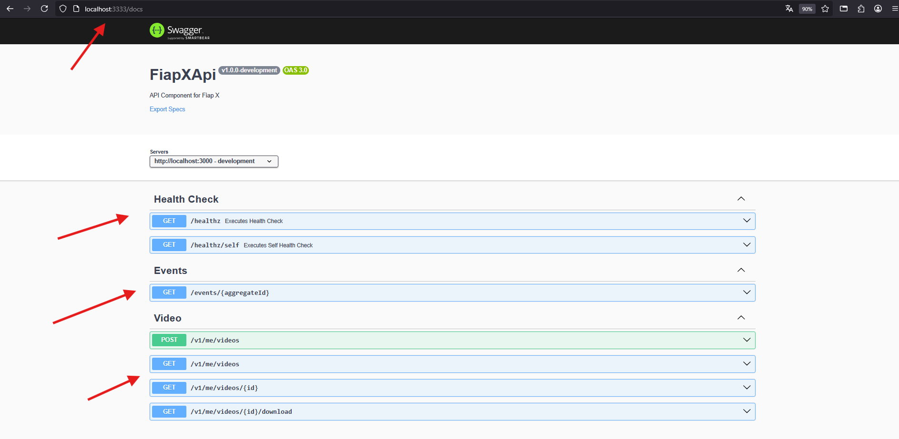

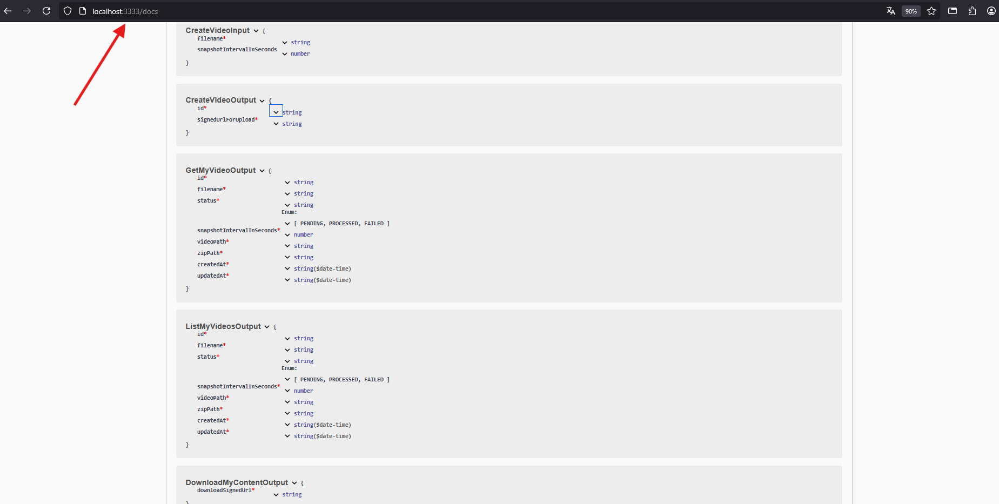

### Identity
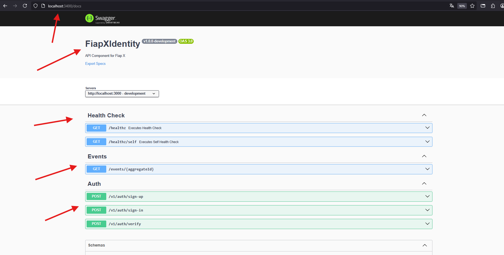
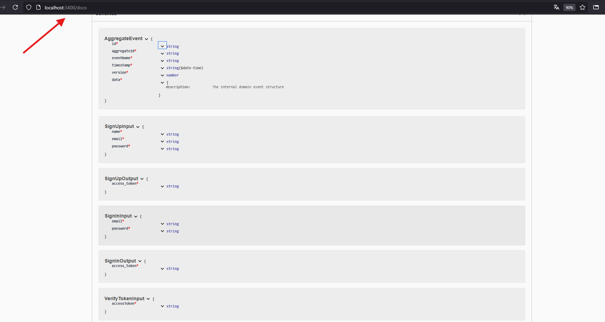

## Data Engineering
Como banco de dados foi escolhido a utilização do MongoDB por ser um banco bastante flexível e escalável garantindo assim a continuidade dos serviços. 
Para garantir o isolamento entre as entidades de cada serviço foi realizada a criação de um banco de dados para cada microserviço, garantindo assim o isolamento da persistência de domínio de cada serviço.

## Requisitos:

### Requisitos Funcionais:

- Autenticação
- Upload de arquivos de vídeo
- Download de arquivos
- Notificações de processamento

### Não Funcionais:

- Infraestrutura provisionada por esteiras automatizadas
- Ambiente em núvem - Aws
- Resiliencia
- Proteção das branches principais
- Cobertura de 80% de código
- Disposição de Microserviços

## Evidências:

### Fiap X API

#### Pipeline

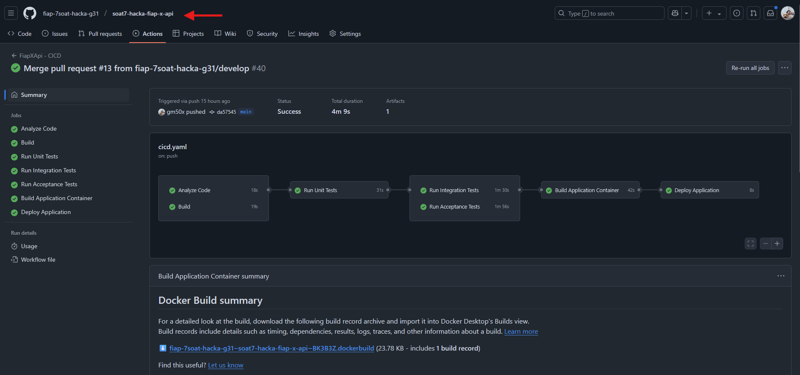

#### Unit Tests

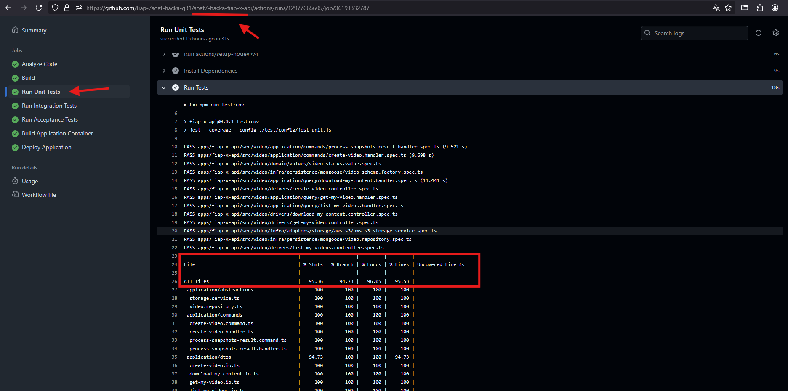

#### Integration Testes

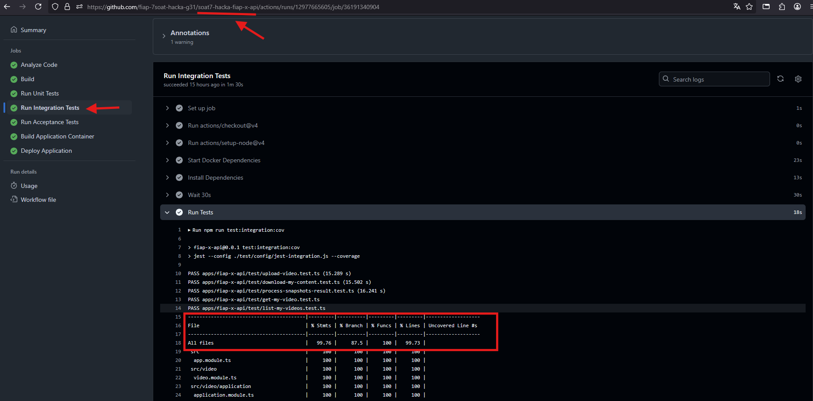

### Fiap X Worker

#### Pipeline

#### Unit Tests

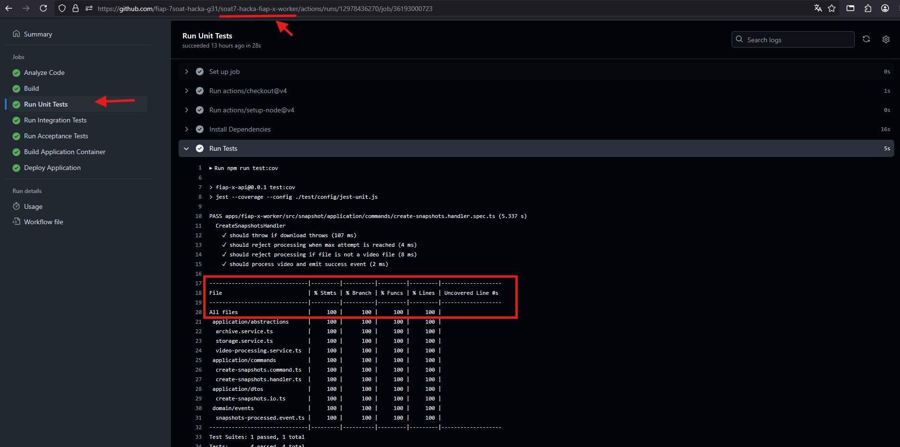

#### Integration Testes

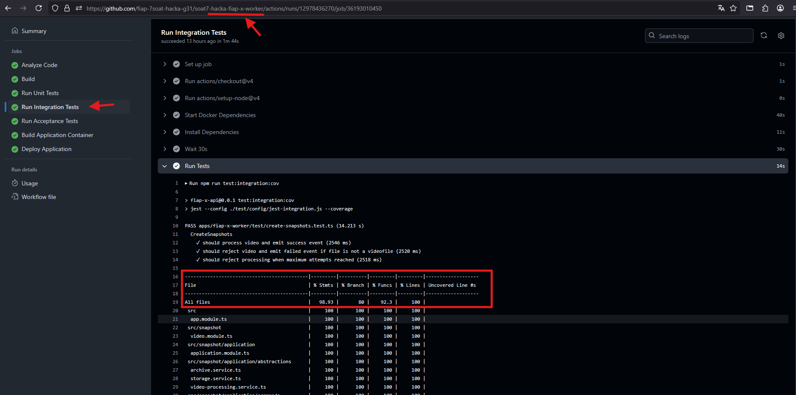

### Fiap X Identity

#### Pipeline

#### Unit Tests

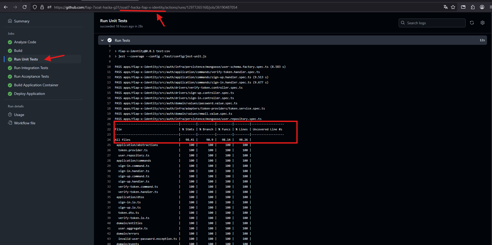

#### Integration Testes

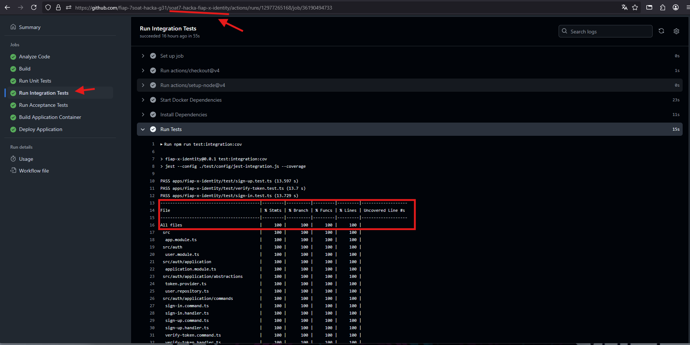

### Fiap X Notifications

#### Pipeline

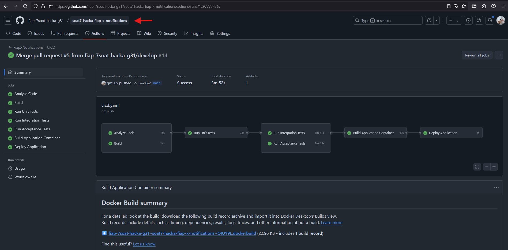

#### Unit Tests

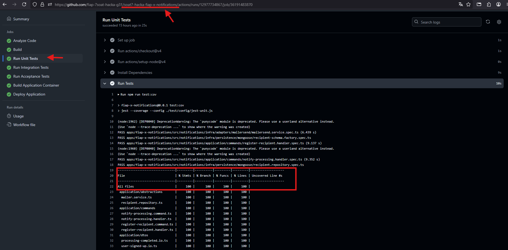

#### Integration Testes

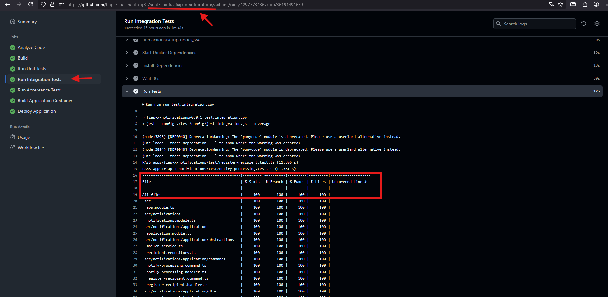
